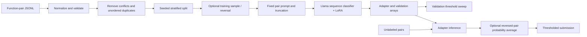

# TuneQuest — Semantic Code Clone Classification

TuneQuest investigates whether two source functions are semantically equivalent using transformer sequence classifiers with parameter-efficient fine-tuning. It contains a reconstructed, configurable Llama BF16 LoRA workflow and an archive of the original SmolLM and Llama QLoRA experiments. Built with Llama.

This is research tooling, not a deployed application or a formal equivalence checker. Label `1` means equivalent; label `0` means not equivalent. Predictions do not prove program equivalence.

## Contents

- [Problem and motivation](#problem-and-motivation)
- [Implemented capabilities](#implemented-capabilities)
- [Pipeline](#pipeline)
- [Installation](#installation)
- [Data and models](#data-and-models)
- [Recommended execution path](#recommended-execution-path)
- [Methodology](#methodology)
- [Configuration and generated files](#configuration-and-generated-files)
- [Command reference](#command-reference)
- [Evidence and results](#evidence-and-results)
- [Research experiments](#research-experiments)
- [Testing and verification](#testing-and-verification)
- [Repository structure](#repository-structure)
- [Troubleshooting](#troubleshooting)
- [Limitations and future work](#limitations-and-future-work)
- [Assets, credentials and licensing](#assets-credentials-and-licensing)

## Problem and motivation

Two functions can implement the same behavior while using different names, syntax or control flow. Finding these semantic code clones can support duplicate-code analysis, software maintenance and research on learned representations of source code. Exact text matching alone cannot capture every such relationship.

TuneQuest represents a pair of functions as a fixed text prompt and learns a binary classification decision. It uses a pretrained decoder-only transformer as a sequence classifier, adapting selected attention projections with LoRA while training the classification head. The project explores several model and preprocessing choices and retains the evidence available for those experiments.

The system accepts source code as text. It does not execute functions, compare test outputs, verify types or prove equivalence. The supplied data does not establish a supported language list or cross-language benchmark, so no such claim is made.

## Implemented capabilities

- Normalize code whitespace without rewriting syntax or internal indentation.
- Remove contradictory unordered pairs and exact/reversed duplicates before a stratified split.
- Sample training pairs with seed 42, optionally augment training with reversed pairs, and record a preprocessing audit.
- Fine-tune a two-class Llama classifier with LoRA and a trainable `score` head.
- Save adapters, tokenizer, validation logits, probabilities, labels and an F1-selected threshold.
- Load a compatible sequence classification adapter, predict probabilities, optionally average both pair orientations, and produce submission CSVs.
- Evaluate saved probabilities independently of model downloads or GPUs.

The original code did not include the producer of its TTA probabilities. The supported prediction implementation is reconstructed and tested with synthetic models; it has not been shown to reproduce the historical TTA CSV.

## Pipeline



## Installation

Use Python 3.11 or newer; the reconstruction was tested on Windows with Python 3.11.0. Run commands from the repository root. Access to this private repository requires an authorized GitHub account.

```text
git clone https://github.com/preyash309/tunequest-code-clones.git
cd tunequest-code-clones
```

### Lightweight setup

The CLI, configuration check and CSV submission command require only the project package. Array-based evaluation additionally requires NumPy; preprocessing and model operations need their respective optional dependencies.

```powershell
python -m venv .venv
.venv\Scripts\Activate.ps1
python -m pip install -e .
python -m tunequest --help
python -m unittest discover -s tests -v
```

On Linux/macOS:

```bash
python3 -m venv .venv
source .venv/bin/activate
python -m pip install -e .
python -m tunequest --help
```

### Full research environment

For the full ML workflow, install the appropriate CUDA PyTorch build for your platform first, then:

```text
python -m pip install -e ".[ml]"
python -m pip check
```

The ML extra pins direct dependencies to versions observed in the supplied environment. It is not a complete transitive lockfile. See [reproducibility and validation](docs/REPRODUCIBILITY.md) for the exact tested environment and limits. Training requires CUDA and BF16 support. CPU FP32 inference is available but slow for a full model. QLoRA archives additionally need bitsandbytes; they are not the supported default path.

| Operation | Required libraries | Hardware / external assets |
| --- | --- | --- |
| Help, config check, submission CSV | Standard library and installed project | CPU; existing probability CSV for submission |
| Evaluate saved arrays | NumPy | CPU; one-dimensional probability and label NPY arrays |
| Preprocess pairs | pandas, scikit-learn, datasets | CPU; authorized labeled JSONL; sufficient RAM and disk |
| Train supported classifier | PyTorch, Transformers, PEFT, Accelerate, datasets, NumPy, scikit-learn | CUDA with BF16 support; processed dataset; authorized base-model access |
| Predict using an adapter | PyTorch, Transformers, PEFT | Adapter and matching base model; BF16 CUDA or CPU FP32 |

The supplied environment used PyTorch `2.11.0+cu128`, Transformers `5.15.0` and PEFT `0.20.0`. Platform-specific installation may differ. There is no guaranteed minimum VRAM figure, and the pipeline loads data into memory rather than streaming an arbitrarily large corpus.

## Data and models

Supply an authorized JSONL file containing `id`, `func1`, `func2` and numeric binary `label` fields. IDs must be unique. Predictions require the same fields except `label`. [examples/pairs.jsonl](examples/pairs.jsonl) contains two synthetic examples for inference only; it is too small for stratified training.

### Input schema

JSONL contains one complete JSON object per line. Store code line breaks as escaped `\n` inside each JSON string.

| Field | Training | Prediction | Meaning |
| --- | --- | --- | --- |
| `id` | Required | Required | Non-null, unique pair identifier; consistent string IDs are recommended |
| `func1` | Required | Required | First source function as text |
| `func2` | Required | Required | Second source function as text |
| `label` | Required | Ignored if supplied | Numeric `0` or `1`; string labels are not accepted by preprocessing |

Illustrative labeled record, not a training dataset:

```json
{"id":"example-001","func1":"def add_one(x):\n    return x + 1","func2":"def increment(value):\n    return 1 + value","label":1}
```

Prediction input has the same layout without `label`. The prediction path requires nonempty function strings and does not require ground-truth labels. Preprocessing removes missing function/label rows and functions that become empty after normalization, rejects invalid labels and audits IDs before cleaning.

The stratified split needs enough examples of both classes to populate its train and validation partitions. Very small or severely imbalanced inputs can be rejected by scikit-learn. Provide a real dataset for training; the two checked-in synthetic pairs are a format demonstration.

### Dataset and checkpoint availability

No dataset origin, download URL, license or human-label provenance was supplied. Real datasets, derived Arrow files and checkpoints are deliberately excluded. Obtain them from the original project owner or use your own authorized function pairs. Do not assume that the local `train_small.jsonl` is a specific public benchmark.

The supported configuration uses [Meta Llama 3.2 1B](https://huggingface.co/meta-llama/Llama-3.2-1B). Access requires the model provider's approval and applicable terms. Authenticate with Hugging Face using your own account; an optional `HF_TOKEN` process environment variable is supported by the upstream libraries. `.env.example` is illustrative and is not automatically loaded. For offline execution provide a local base model path in training configuration. Saved adapters reference their base model in `adapter_config.json`.

Model and dataset provenance constraints are described in [asset requirements](docs/ASSETS.md). No project license has been invented or granted.

Prediction needs both the adapter weights and its tokenizer files. The JSON metadata under `experiments/evidence/` is evidence of the original settings, not a usable checkpoint. Copying an adapter configuration alone will not enable inference.

## Recommended execution path

### 1. Prepare an audited dataset

Place an authorized labeled file at `data/train.jsonl`, then create a processed dataset from genuine training labels:

```text
python -m tunequest preprocess --input data/train.jsonl --output data/processed --sample-size 250000
```

The default validation fraction is `0.05`; the default seed is `42`. Omit `--sample-size` to use all available training pairs. Sampling never changes which cleaned pairs were selected for validation. An optional reversal study can use a separate dataset directory:

```text
python -m tunequest preprocess --input data/train.jsonl --output data/processed_symmetric --sample-size 250000 --symmetry
```

`--symmetry` doubles the sampled training rows by adding reversed pairs. Validation is left unaugmented. Set the corresponding `dataset_path` in a separate training configuration when using this alternative.

### 2. Check settings and train

```text
python -m tunequest train --config configs/bf16.json --check-config
python -m tunequest train --config configs/bf16.json
```

`--check-config` validates the configuration schema and prints the parsed settings. It does not download a model, inspect the dataset contents, check hardware or start training.

`configs/bf16.json` preserves the BF16 experiment's model, seed, 1 epoch, 1,024-token truncation, physical batch 2, gradient accumulation 8, learning rate 0.0002, warmup 470, LoRA rank 16/alpha 64/dropout 0.05, attention projection targets and trainable classification head. The original BF16 experiment used 4,500 pseudo-labeled examples; the recommended use of genuine labels is a deliberate different data choice, not a claim of reproducing that checkpoint. Tune sample size to the available data; oversized requests use the complete training pool.

Warmup is retained for historical compatibility. On 4,500 training rows it exceeds the approximately 282 optimizer steps, so the original run stays in warmup throughout. Choose and record a different configuration for a new study if appropriate. Do not interpret the preserved configuration as an optimized recipe.

Paths are relative to your working directory. Preprocessing and CLI training refuse existing output locations. Keep a separate configuration/output path per run. Saved training outputs use the configured output directory plus `_final`.

### 3. Evaluate saved validation predictions

```text
python -m tunequest evaluate --probabilities outputs/llama_bf16_lora_final/validation_p_class1.npy --labels outputs/llama_bf16_lora_final/validation_labels.npy --sweep
```

Evaluation prints sample count, threshold, accuracy, precision, recall and F1 as JSON. Use `--threshold 0.5` instead of `--sweep` to evaluate a fixed decision rule. Probability and label arrays must be one-dimensional, nonempty and have equal length. NumPy files are loaded with pickle disabled.

### 4. Predict probabilities and create a submission

```text
python -m tunequest predict --input data/test.jsonl --adapter outputs/llama_bf16_lora_final --output outputs/probabilities.csv --tta
python -m tunequest submission --input outputs/probabilities.csv --output outputs/submission.csv --threshold 0.5
```

Replace `0.5` with a threshold selected on an appropriate validation set. `--tta` averages class-1 probabilities, not logits, from the original and reversed prompts. The original teacher and TTA aggregation implementation are unknown. Without `--tta`, `p_reverse` repeats `p_forward`. Inference uses the historical prompt, 1,024 tokens and right padding by default; specify `--max-length` to match another experiment. Long functions can be truncated.

For a slower CPU prediction run, explicitly select FP32 CPU inference:

```text
python -m tunequest predict --input examples/pairs.jsonl --adapter outputs/llama_bf16_lora_final --output outputs/example_probabilities.csv --device cpu --batch-size 2
```

This requires an actual compatible adapter and accessible base model. The examples alone do not include or create trained weights.

### 5. Try the model-free example

A model-free demonstration works immediately:

```text
python -m tunequest submission --input examples/probabilities.csv --output outputs/example_submission.csv --threshold 0.5
```

Its output is `id,label`, with `synthetic-1,0` and `synthetic-2,1`.

```csv
id,label
synthetic-1,0
synthetic-2,1
```

Choose a new output filename if you repeat the command: submission and prediction commands refuse to overwrite an existing file.

## Methodology

### Pair preparation and split integrity

The supported preprocessing order is:

1. Validate columns and reject null or duplicated IDs.
2. Remove missing function/label records; reject nonbinary labels.
3. Normalize line endings, strip trailing whitespace on each line and trim surrounding whitespace.
4. Remove functions that become empty.
5. Build an unordered tuple key from the two normalized functions.
6. Remove every row belonging to a pair with contradictory labels.
7. Deduplicate exact and reversed pairs, keeping the first original orientation.
8. Create the seeded, label-stratified train/validation split.
9. Optionally sample the training pool, then optionally add reversed training pairs.
10. Audit cross-split ID/pair overlap, construct prompts, shuffle training and save the DatasetDict and report.

Reversal augmentation intentionally repeats each training pair's ID in its two orientations. IDs remain disjoint across training and validation. These checks prevent exact pair overlap; they do not prove that source functions or originating repositories are independent across splits.

### Prompt and classifier

Both functions are inserted into the same prompt used by the original sampled experiments:

```text
Determine if Function 1 and Function 2 are semantically equivalent.
### Function 1:
<first function>
### Function 2:
<second function>
### Equivalent:
```

The label is a separate training target. The model emits two classification logits rather than generating a textual answer. Tokenization truncates the whole prompt at the configured length; it does not allocate a separate token budget to each function. Training uses dynamic padding to multiples of eight and right padding; EOS becomes the padding token when the tokenizer has none.

The BF16 implementation attaches LoRA to `q_proj`, `k_proj`, `v_proj` and `o_proj`, with `bias="none"` and `task_type="SEQ_CLS"`. `modules_to_save=["score"]` keeps the classifier head trainable and includes it in the saved adapter. Loading this head matters because the base model's classification head starts randomly initialized.

### Probability averaging and threshold selection

For an input pair `(A, B)`, inference obtains the positive-class softmax probability. With `--tta`, it also scores `(B, A)` and computes:

```text
p_final = (p_forward + p_reverse) / 2
label = 1 if p_final >= threshold else 0
```

The evaluation sweep checks thresholds from `0.05` to `0.95` in increments of `0.005`. It keeps the first threshold that strictly improves F1; when all candidates have zero F1, it retains `0.5`. The standalone evaluator uses decimal grid values, while the preserved trainer uses NumPy's historical floating-point grid. This distinction can affect values exactly at a floating-point boundary; the saved 250-example result agrees.

The trainer's saved validation probabilities are produced from the stored validation prompts, without TTA. A threshold selected on these probabilities is not automatically optimal for averaged TTA probabilities. Validate the same inference procedure you intend to deploy, using a suitable independent validation set.

## Configuration and generated files

### Training configuration

The exact schema is in [configs/bf16.json](configs/bf16.json). All listed keys are required; unknown keys are rejected. Create a copy of this file and pass its path with `--config` for a separate run.

| Setting | Default | Purpose |
| --- | --- | --- |
| `model_id` | `meta-llama/Llama-3.2-1B` | Hugging Face identifier or authorized local base-model directory |
| `dataset_path` | `data/processed` | Saved HF DatasetDict with `train` and `validation` splits |
| `output_dir` | `outputs/llama_bf16_lora` | Trainer output path; final adapter uses the `_final` suffix |
| `max_seq_length` | `1024` | Maximum tokenized prompt length |
| `seed` | `42` | Model/training random seed |
| `num_epochs` | `1` | Training epochs |
| `per_device_train_batch_size` | `2` | Physical training batch size |
| `gradient_accumulation_steps` | `8` | Accumulate gradients across eight batches |
| `per_device_eval_batch_size` | `8` | Validation batch size |
| `learning_rate` | `0.0002` | Optimizer learning rate |
| `weight_decay` | `0.01` | Weight decay |
| `warmup_steps` | `470` | Optimizer warmup steps, retained from the original run |
| `lora_r` | `16` | LoRA rank |
| `lora_alpha` | `64` | LoRA scaling parameter |
| `lora_dropout` | `0.05` | LoRA dropout probability |

On one GPU, the nominal effective batch size is `2 × 8 = 16` pairs. The supported trainer also retains a cosine scheduler, fused AdamW, no gradient checkpointing, no intermediate checkpoint saving and no evaluation during training. Final evaluation runs after adapter saving. Training metrics are printed; the implementation does not write a separate consolidated metrics JSON file.

### Output contracts

| Output | Contents / purpose |
| --- | --- |
| `data/processed/train/` and `validation/` | HF saved splits containing `id`, `func1`, `func2`, `prompt`, `label`; augmented training also has `orientation` |
| `data/processed/preprocessing_report.json` | Raw/clean counts, conflict count, training pool/sample counts, class distributions, seed and overlap audits |
| `outputs/llama_bf16_lora_final/adapter_config.json` | PEFT architecture and base-model reference |
| `outputs/llama_bf16_lora_final/adapter_model.safetensors` | Learned LoRA weights and saved classification head |
| Final tokenizer files | Tokenizer assets needed when loading the adapter |
| `validation_logits.npy` | Validation logits, shape `(N, 2)` |
| `validation_labels.npy` | Validation targets, shape `(N,)` |
| `validation_p_class1.npy` | Positive-class probabilities, shape `(N,)` |
| `best_threshold.txt` | F1-selected validation threshold |
| Prediction CSV | `id,p_forward,p_reverse,p_final` |
| Submission CSV | `id,label`, preserving the input probability CSV's row order |

The prediction command checks unique IDs and writes finite softmax probabilities. Submission requires at least `id` and `p_final`, rejects duplicate IDs and probabilities outside `[0, 1]`, and uses an inclusive threshold comparison. Extra probability columns are not required for submission.

## Command reference

Both `python -m tunequest` and the installed `tunequest` console command invoke the same CLI. Use `python -m tunequest <command> --help` for argument details.

| Command | Required arguments | Optional arguments and defaults |
| --- | --- | --- |
| `preprocess` | `--input`, `--output` | `--sample-size` (all if omitted), `--validation-fraction 0.05`, `--seed 42`, `--symmetry` |
| `train` | None; default config exists in repository | `--config configs/bf16.json`, `--check-config` |
| `predict` | `--input`, `--adapter`, `--output` | `--max-length 1024`, `--batch-size 8`, `--device cuda` or `cpu`, `--tta` |
| `submission` | `--input`, `--output`, `--threshold` | None |
| `evaluate` | `--probabilities`, `--labels` | `--threshold 0.5`, `--sweep` (takes precedence over fixed threshold) |

## Evidence and results

The saved BF16 arrays contain 250 validation examples (231 negative, 19 positive). Their labels came from `test_with_model_labels.jsonl`. Recomputing metrics from these arrays gives:

| Threshold | Precision | Recall | F1 | Accuracy |
| --- | ---: | ---: | ---: | ---: |
| 0.50 | 1.0000 | 0.0526 | 0.1000 | 0.9280 |
| 0.06 (saved and sweep-selected) | 0.4483 | 0.6842 | 0.5417 | 0.9120 |

These measure agreement with model labels, not independently verified semantic accuracy. The threshold is tuned on the same validation set; this is not a held-out test score. Metrics were recomputed from existing arrays; full historical training and inference were not rerun. [Machine-readable evidence](experiments/evidence/bf16_recomputed_metrics.json) records these qualifications.

The preprocessing reports record 496,669 cleaned pairs from 500,000 raw pairs, with 24,834 validation pairs, and a separate 5,000-row pseudo-label dataset with 4,500 sampled training and 250 validation pairs. These counts are historical artifacts. The 5,000-row sampled preprocessing was independently reproduced with identical rows, columns and ordering. No leaderboard result or controlled ablation outcome was supplied. See [EXPERIMENTS.md](EXPERIMENTS.md).

## Research experiments

| Variant | Distinguishing choices | Available evidence |
| --- | --- | --- |
| Symmetric preprocessing | Split before reversal; augment training only | Original report: 943,670 augmented training rows and 24,834 validation rows |
| SmolLM QLoRA | SmolLM-1.7B, 4-bit NF4 with double quantization, all-linear LoRA rank32, 1,536 tokens | Archived source and token audit; no final adapter or verified score found |
| Llama QLoRA | Llama-3.2-1B, NF4 without double quantization, attention LoRA rank16, 768 tokens | Adapter metadata and privately retained weights; no saved evaluation arrays |
| Llama BF16 LoRA | Full BF16 base, attention LoRA rank16, 1,024 tokens, 4,500 sampled model-labeled pairs | Adapter metadata, original local weights/arrays and recomputed validation metrics |
| Threshold variants | Reapply .35/.37/.38 to existing TTA probabilities | Three local submissions; all reproduced by the supported threshold command |

These are historical alternatives, not a controlled ablation table. They differ in datasets, precision, token limits, batches and training duration. No evidence establishes which model variant is scientifically superior. The QLoRA scripts currently set `max_steps=100`, while the BF16 script runs one epoch. See [EXPERIMENTS.md](EXPERIMENTS.md) for the full configuration history and stale-script caveats.

## Testing and verification

```text
python -m unittest discover -s tests -v
python -m tunequest train --check-config
python -m pip check
```

Verification performed during reconstruction:

| Check | Actual outcome |
| --- | --- |
| Full available unit/data/adapter suite | 12 tests passed in the supplied ML environment |
| Fresh clone in a clean lightweight environment | Package installed; seven core tests passed; five optional tests skipped explicitly; config and example submission worked |
| Sampled preprocessing regression | Every field and row order matched for 4,500 training and 250 validation examples |
| Historical submission regression | All 5,000 rows matched for each of the .35, .37 and .38 CSVs |
| Tiny-model CUDA smoke | Synthetic training, adapter save/reload, TTA prediction and array evaluation passed |
| GitHub CI | Core and preprocessing jobs passed for the reconstruction commit |

The optional adapter test builds a tiny random Llama model locally; it does not download a pretrained model. Optional tests skip when their dependencies are absent. CI exercises the lightweight and data workflows, not full GPU training. The [reconstruction CI run](https://github.com/preyash309/tunequest-code-clones/actions/runs/36311179631) and [current workflow runs](https://github.com/preyash309/tunequest-code-clones/actions) provide execution records.

Synthetic results establish that the pipeline's components work together. They are not model-quality measurements. See [docs/REPRODUCIBILITY.md](docs/REPRODUCIBILITY.md) for exact versions, checks and unresolved reproduction limits.

## Repository structure

```text
TuneQuest/
├── README.md
├── EXPERIMENTS.md
├── pyproject.toml
├── .env.example
├── .github/workflows/tests.yml
├── configs/bf16.json
├── src/tunequest/
│   ├── __init__.py
│   ├── __main__.py
│   ├── cli.py                  # arguments, configuration checks, dispatch
│   ├── common.py               # normalization, prompt, metrics, sweep
│   ├── preprocessing.py        # cleaning, split, sampling, dataset audit
│   ├── training.py             # preserved callable BF16 LoRA method
│   └── prediction.py           # adapter loading, TTA, submission CSV
├── tests/
│   ├── test_core.py
│   ├── test_preprocessing.py
│   └── test_model.py
├── examples/
│   ├── pairs.jsonl
│   └── probabilities.csv
├── experiments/
│   ├── archive/                # eight unchanged original research scripts
│   └── evidence/               # small reports and adapter metadata
└── docs/
    ├── ASSETS.md
    ├── MIGRATION.md
    └── REPRODUCIBILITY.md
```

On the original machine, `/TuneQuest/` retains the original project and `.local/original/` contains a complete independent backup. Both are ignored and are absent from a fresh clone. [Migration map](docs/MIGRATION.md) explains each source's supported counterpart.

## Troubleshooting

| Symptom | Cause to check | Next step |
| --- | --- | --- |
| GitHub link shows 404 | Private repository; account lacks access or is signed out | Sign in with the owning/authorized GitHub account |
| `No module named tunequest` | Package not installed in the active interpreter | Activate the intended environment and run `python -m pip install -e .` from repository root |
| Missing NumPy, pandas, datasets, Transformers or PEFT | Lightweight setup intentionally excludes ML dependencies | Install `python -m pip install -e ".[ml]"` in that same environment |
| Missing processed dataset | Training cannot read `dataset_path` | Run preprocessing first and check the configuration path |
| Missing columns / invalid labels | Input schema does not match the supported JSONL contract | Check fields, numeric binary labels and one JSON object per line |
| Duplicate/null ID error | Input IDs are not unique and non-null before cleaning | Correct IDs at the source rather than hiding the conflict |
| Stratification error | Too few members of a class or too small a split/sample | Inspect class counts and choose a feasible dataset, fraction and sample size |
| Output already exists | Commands protect existing research outputs | Choose a new output path and, for training, a matching new configuration |
| CUDA/BF16 requirement error | Supported training or CUDA prediction lacks BF16 hardware | Use compatible hardware for training; choose `--device cpu` for FP32 prediction |
| GPU out of memory | Batch size, model or prompt length exceeds available memory | Lower the batch size first; record any token-length change because it changes the input protocol |
| Gated model authorization error | Base model cannot be downloaded by the current Hugging Face account | Obtain provider access and authenticate, or supply an authorized local base model |
| Adapter missing base-model metadata or wrong task | Adapter is incomplete or is not `SEQ_CLS` | Use a compatible complete adapter with its tokenizer and matching base model |

The default CLI paths assume the repository root is the current working directory. Output guards also apply after partial failed runs; preserve the failed run's evidence and use a fresh path for the next attempt. Do not import scripts from `experiments/archive/` as a shortcut: they execute immediately and can overwrite their hardcoded outputs.

## Limitations and future work

- No public dataset source, code ownership verification, base-model revision pin or original runtime lockfile was supplied.
- Pair-level splits prevent exact/reversed pair overlap, but do not ensure function-, repository- or problem-level independence. Related functions may cross splits.
- Normalization is whitespace-based, not a parser or semantic transformation.
- The later BF16 experiment relies on pseudo-labels of unknown origin. Test-set reuse prevents treating its submissions as an unbiased benchmark.
- QLoRA and SmolLM scripts are historical variants, not verified baselines; their current settings run only 100 steps despite comments implying much longer training.
- Full pretrained-model training and historical TTA generation have not been reproduced. Synthetic smoke tests verify plumbing, not scientific quality.
- BF16 training needs supported NVIDIA hardware and sufficient memory; no guaranteed VRAM requirement is asserted.

Useful next work is to establish dataset provenance, obtain a genuine independent test set, pin the base-model revision and a transitive environment, reproduce the QLoRA alternatives, and measure the effect of pair reversal under a common protocol.

## Assets, credentials and licensing

The repository includes source code, configuration, small aggregate evidence and synthetic examples. It excludes raw/processed datasets, original probability/submission CSVs, validation arrays, checkpoint weights, tokenizer bundles, virtual environments, private backup files and credentials. Ignored locations include `data/`, `checkpoints/`, `outputs/`, `.venv/` and `.local/`.

`.env.example` contains placeholders only. Copying it to `.env` does not configure the application automatically; export variables into the process environment yourself. Never commit real `HF_TOKEN` values. Upstream Hugging Face libraries handle model authentication.

Llama use is subject to the provider's model terms; the historical SmolLM variant has its own model license. No pretrained weights are distributed here. The original project did not supply a code license or ownership record, so this reconstruction does not grant an unsupported license. Dataset and adapter redistribution rights must be established before sharing those assets. Details and provider links are in [docs/ASSETS.md](docs/ASSETS.md).
