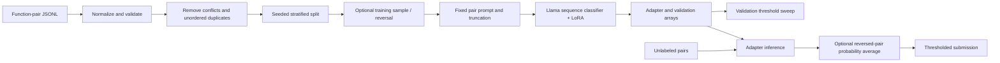

# TuneQuest — Semantic Code Clone Classification

TuneQuest investigates whether two source functions are semantically equivalent using transformer sequence classifiers with parameter-efficient fine-tuning. It contains a reconstructed, configurable Llama BF16 LoRA workflow and an archive of the original SmolLM and Llama QLoRA experiments. Built with Llama.

This is research tooling, not a deployed application or a formal equivalence checker. Label `1` means equivalent; label `0` means not equivalent. Predictions do not prove program equivalence.

## Implemented capabilities

- Normalize code whitespace without rewriting syntax or internal indentation.
- Remove contradictory unordered pairs and exact/reversed duplicates before a stratified split.
- Sample training pairs with seed 42, optionally augment training with reversed pairs, and record a preprocessing audit.
- Fine-tune a two-class Llama classifier with LoRA and a trainable `score` head.
- Save adapters, tokenizer, validation logits, probabilities, labels and an F1-selected threshold.
- Load a compatible sequence classification adapter, predict probabilities, optionally average both pair orientations, and produce submission CSVs.
- Evaluate saved probabilities independently of model downloads or GPUs.

The original code did not include the producer of its TTA probabilities. The supported prediction implementation is reconstructed and tested with synthetic models; it has not been shown to reproduce the historical TTA CSV.

## Pipeline



## Installation

Use Python 3.11 or newer; the reconstruction was tested on Windows with Python 3.11.0. Run commands from the repository root. The lightweight CLI, metrics and submission commands need no ML dependencies.

```powershell
python -m venv .venv
.venv\Scripts\Activate.ps1
python -m pip install -e .
python -m tunequest --help
python -m unittest discover -s tests -v
```

On Linux/macOS activate with `source .venv/bin/activate`. For the full ML workflow, install the appropriate CUDA PyTorch build for your platform first, then:

```text
python -m pip install -e ".[ml]"
python -m pip check
```

The ML extra pins direct dependencies to versions observed in the supplied environment. It is not a complete transitive lockfile. See [reproducibility and validation](docs/REPRODUCIBILITY.md) for the exact tested environment and limits. Training requires CUDA and BF16 support. CPU FP32 inference is available but slow for a full model. QLoRA archives additionally need bitsandbytes; they are not the supported default path.

## Data and models

Supply an authorized JSONL file containing `id`, `func1`, `func2` and numeric binary `label` fields. IDs must be unique. Predictions require the same fields except `label`. [examples/pairs.jsonl](examples/pairs.jsonl) contains two synthetic examples for inference only; it is too small for stratified training.

No dataset origin, download URL, license or human-label provenance was supplied. Real datasets, derived Arrow files and checkpoints are deliberately excluded. Obtain them from the original project owner or use your own authorized function pairs. Do not assume that the local `train_small.jsonl` is a specific public benchmark.

The supported configuration uses [Meta Llama 3.2 1B](https://huggingface.co/meta-llama/Llama-3.2-1B). Access requires the model provider's approval and applicable terms. Authenticate with Hugging Face using your own account; an optional `HF_TOKEN` process environment variable is supported by the upstream libraries. `.env.example` is illustrative and is not automatically loaded. For offline execution provide a local base model path in training configuration. Saved adapters reference their base model in `adapter_config.json`.

Model and dataset provenance constraints are described in [asset requirements](docs/ASSETS.md). No project license has been invented or granted.

## Recommended execution path

First create a processed dataset from genuine training labels:

```text
python -m tunequest preprocess --input data/train.jsonl --output data/processed --sample-size 250000
python -m tunequest train --config configs/bf16.json --check-config
python -m tunequest train --config configs/bf16.json
```

`configs/bf16.json` preserves the BF16 experiment's model, seed, 1 epoch, 1,024-token truncation, physical batch 2, gradient accumulation 8, learning rate 0.0002, warmup 470, LoRA rank 16/alpha 64/dropout 0.05, attention projection targets and trainable classification head. The original BF16 experiment used 4,500 pseudo-labeled examples; the recommended use of genuine labels is a deliberate different data choice, not a claim of reproducing that checkpoint. Tune sample size to the available data; oversized requests use the complete training pool.

Warmup is retained for historical compatibility. On 4,500 training rows it exceeds the approximately 282 optimizer steps, so the original run stays in warmup throughout. Choose and record a different configuration for a new study if appropriate. Do not interpret the preserved configuration as an optimized recipe.

Paths are relative to your working directory. Preprocessing and CLI training refuse existing output locations. Keep a separate configuration/output path per run. Saved training outputs use the configured output directory plus `_final`.

```text
python -m tunequest evaluate --probabilities outputs/llama_bf16_lora_final/validation_p_class1.npy --labels outputs/llama_bf16_lora_final/validation_labels.npy --sweep
python -m tunequest predict --input data/test.jsonl --adapter outputs/llama_bf16_lora_final --output outputs/probabilities.csv --tta
python -m tunequest submission --input outputs/probabilities.csv --output outputs/submission.csv --threshold 0.5
```

Replace `0.5` with a threshold selected on an appropriate validation set. `--tta` averages class-1 probabilities, not logits, from the original and reversed prompts. The original teacher and TTA aggregation implementation are unknown. Without `--tta`, `p_reverse` repeats `p_forward`. Inference uses the historical prompt, 1,024 tokens and right padding by default; specify `--max-length` to match another experiment. Long functions can be truncated.

A model-free demonstration works immediately:

```text
python -m tunequest submission --input examples/probabilities.csv --output outputs/example_submission.csv --threshold 0.5
```

Its output is `id,label`, with `synthetic-1,0` and `synthetic-2,1`.

## Evidence and results

The saved BF16 arrays contain 250 validation examples (231 negative, 19 positive). Their labels came from `test_with_model_labels.jsonl`. Recomputing metrics from these arrays gives:

| Threshold | Precision | Recall | F1 | Accuracy |
| --- | ---: | ---: | ---: | ---: |
| 0.50 | 1.0000 | 0.0526 | 0.1000 | 0.9280 |
| 0.06 (saved and sweep-selected) | 0.4483 | 0.6842 | 0.5417 | 0.9120 |

These measure agreement with model labels, not independently verified semantic accuracy. The threshold is tuned on the same validation set; this is not a held-out test score. Metrics were recomputed from existing arrays; full historical training and inference were not rerun. [Machine-readable evidence](experiments/evidence/bf16_recomputed_metrics.json) records these qualifications.

The preprocessing reports record 496,669 cleaned pairs from 500,000 raw pairs, with 24,834 validation pairs, and a separate 5,000-row pseudo-label dataset with 4,500 sampled training and 250 validation pairs. These counts are historical artifacts. The 5,000-row sampled preprocessing was independently reproduced with identical rows, columns and ordering. No leaderboard result or controlled ablation outcome was supplied. See [EXPERIMENTS.md](EXPERIMENTS.md).

## Repository structure

```text
src/tunequest/          supported preprocessing, training, prediction, metrics and CLI
configs/bf16.json       preserved training hyperparameters with portable paths
tests/                 core, data and optional tiny-model regression tests
examples/              synthetic function pairs and probabilities
experiments/archive/   original research scripts, unchanged and unsupported
experiments/evidence/  small reports and adapter metadata, no model weights
docs/                  migration map, asset requirements and validation report
.github/workflows/     lightweight core and preprocessing CI
```

On the original machine, `/TuneQuest/` retains the original project and `.local/original/` contains a complete independent backup. Both are ignored and are absent from a fresh clone. [Migration map](docs/MIGRATION.md) explains each source's supported counterpart.

## Limitations and future work

- No public dataset source, code ownership verification, base-model revision pin or original runtime lockfile was supplied.
- Pair-level splits prevent exact/reversed pair overlap, but do not ensure function-, repository- or problem-level independence. Related functions may cross splits.
- Normalization is whitespace-based, not a parser or semantic transformation.
- The later BF16 experiment relies on pseudo-labels of unknown origin. Test-set reuse prevents treating its submissions as an unbiased benchmark.
- QLoRA and SmolLM scripts are historical variants, not verified baselines; their current settings run only 100 steps despite comments implying much longer training.
- Full pretrained-model training and historical TTA generation have not been reproduced. Synthetic smoke tests verify plumbing, not scientific quality.
- BF16 training needs supported NVIDIA hardware and sufficient memory; no guaranteed VRAM requirement is asserted.

Useful next work is to establish dataset provenance, obtain a genuine independent test set, pin the base-model revision and a transitive environment, reproduce the QLoRA alternatives, and measure the effect of pair reversal under a common protocol.
